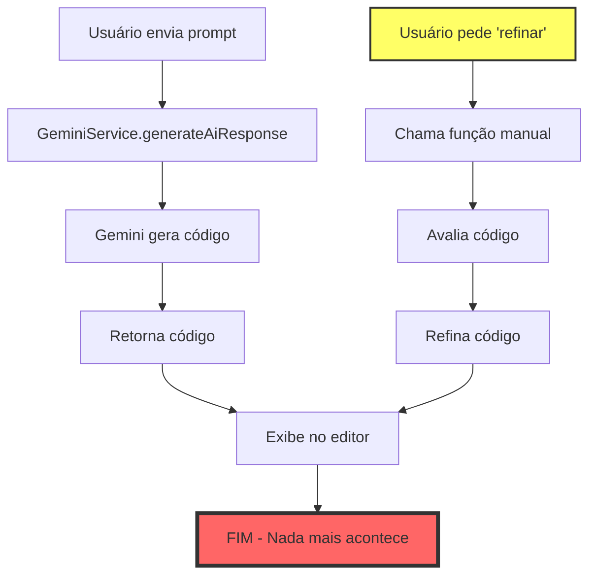
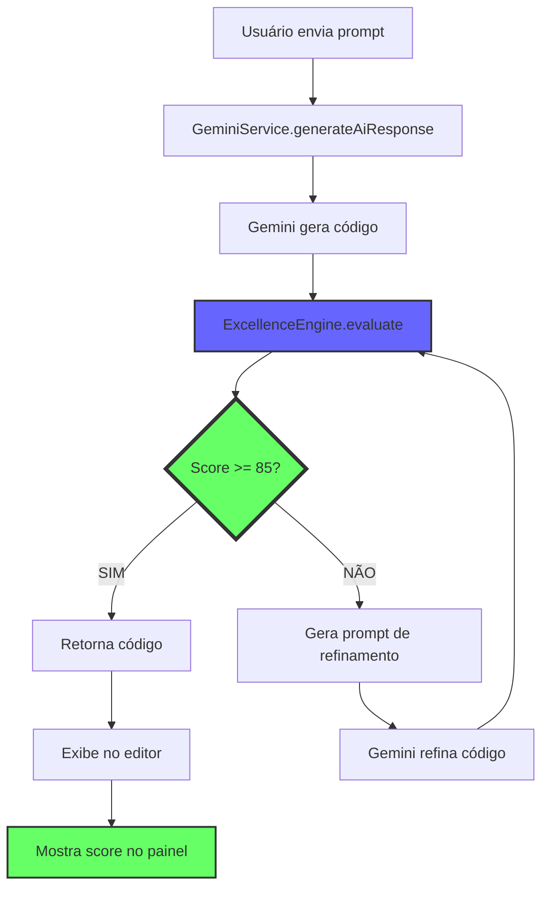

# 🧠 Mapa Mental - Sistema de Auto-Avaliação de Código

## 📊 Visão Geral

O sistema possui **5 sistemas de avaliação diferentes**, mas apenas **1 está integrado corretamente** no fluxo de geração.

---

## 🎯 PROBLEMA IDENTIFICADO

### ❌ **Situação Atual:**
```
Usuário → Gera Código → Código Gerado
                              ↓
                         (NADA ACONTECE)
                              ↓
                    Usuário pede "refinar"
                              ↓
                    Sistema avalia e refina
```

### ✅ **Situação Desejada:**
```
Usuário → Gera Código → Código Gerado
                              ↓
                    AUTO-AVALIAÇÃO AUTOMÁTICA
                              ↓
                    Score < 85? → Refina automaticamente
                              ↓
                    Score >= 85? → Entrega código
```

---

## 🗺️ Mapa dos Sistemas de Avaliação

### **1. ExcellenceCore** ⭐ (PRINCIPAL - MAS NÃO CONECTADO)
**Localização:** `services/ExcellenceCore.ts`

**Função:** Sistema de excelência programável com 7 critérios

**Critérios:**
```
1. Estrutura Semântica (peso 9/10)
2. Meta Tags Essenciais (peso 8/10)
3. Acessibilidade (peso 10/10) ⭐ PRIORIDADE MÁXIMA
4. Responsividade (peso 9/10)
5. Performance (peso 7/10)
6. Segurança (peso 8/10)
7. UX e Estética (peso 7/10)
```

**Score Mínimo:** 85/100

**Classes:**
- `ExcellenceEngine` - Motor de avaliação
- `CompletenessValidator` - Validador de completude

**Status:** ✅ Implementado | ❌ NÃO conectado ao fluxo de geração

**Onde deveria ser chamado:**
```typescript
// Em GeminiService.ts, após gerar código:
const report = ExcellenceEngine.evaluate(generatedCode, HTML_EXCELLENCE_CRITERIA);

if (!report.passed) {
  // Refinar automaticamente
  const refinedCode = await refineCode(generatedCode, report);
  return refinedCode;
}

return generatedCode;
```

---

### **2. ArtisanValidator** 🎨 (SECUNDÁRIO - NÃO USADO)
**Localização:** `services/ArtisanValidator.ts`

**Função:** Valida código contra os 6 Princípios do Manifesto do Artesão Digital

**Princípios:**
```
1. Experiência Primeiro
2. Estrutura Semântica
3. Estilo Adaptativo
4. Interatividade Reativa
5. Resiliência
6. Entrega Completa
```

**Score Mínimo:** 80/100

**Status:** ✅ Implementado | ❌ NUNCA é chamado

**Problema:** Sistema duplicado com ExcellenceCore

---

### **3. CodeQualityChecker** 🔍 (AVANÇADO - NÃO USADO)
**Localização:** `src/utils/CodeQualityChecker.ts`

**Função:** Verificação avançada de qualidade e prontidão para produção

**Métricas (9 critérios):**
```
1. Ausência de Simulação (peso 10)
2. Integração de APIs (peso 8)
3. Implementação de Segurança (peso 9)
4. Tratamento de Erros (peso 7)
5. Validação de Dados (peso 7)
6. Documentação (peso 5)
7. Complexidade (peso 6)
8. Configuração Automática (peso 6)
9. Prontidão para Produção (peso 8)
```

**Score Mínimo:** 80/100

**Status:** ✅ Implementado | ❌ NUNCA é chamado

**Problema:** Muito complexo para HTML simples, focado em backend

---

### **4. QualityAutopilot** 🤖 (PILOTO AUTOMÁTICO - NÃO CONECTADO)
**Localização:** `services/QualityAutopilot.ts`

**Função:** Sistema de refinamento automático iterativo

**Configuração:**
```typescript
{
  enabled: boolean,
  qualityThreshold: 90,
  maxIterations: 3,
  autoApplyImprovements: true,
  pauseBetweenIterations: 2000ms
}
```

**Fluxo:**
```
1. Avalia código
2. Score < threshold?
3. Gera prompt de melhoria
4. Aplica melhorias
5. Repete até atingir threshold ou max iterations
```

**Status:** ✅ Implementado | ❌ NÃO conectado ao fluxo de geração

**Problema:** Precisa ser ativado manualmente pelo usuário

---

### **5. HTMLQualityGuard** 🛡️ (VALIDADOR BÁSICO - USADO PARCIALMENTE)
**Localização:** `services/HTMLQualityGuard.ts`

**Função:** Garantir HTML básico válido (nunca tela branca)

**Validações:**
```
✓ DOCTYPE presente
✓ Tag <html> presente
✓ Tag <head> presente
✓ Tag <body> presente
✓ Charset UTF-8
✓ Meta viewport
✓ Conteúdo visível no body
```

**Status:** ✅ Implementado | ⚠️ Usado apenas em emergências

**Problema:** Só valida estrutura básica, não qualidade

---

## 🔗 Fluxo Atual vs Fluxo Ideal

### **Fluxo Atual (QUEBRADO):**


### **Fluxo Ideal (CORRETO):**


---

## 📍 Onde Cada Sistema Deveria Ser Chamado

### **1. ExcellenceCore** (PRINCIPAL)
**Onde:** `services/GeminiService.ts` → função `generateAiResponse()`

**Quando:** Imediatamente após gerar código

**Código necessário:**
```typescript
// Após gerar código HTML
const report = ExcellenceEngine.evaluate(generatedCode, HTML_EXCELLENCE_CRITERIA);

if (!report.passed) {
  console.log(`Score: ${report.overallScore}/100 - Refinando...`);
  
  // Gerar prompt de refinamento
  const refinementPrompt = `
O código gerado tem score ${report.overallScore}/100.
Problemas encontrados:
${report.improvements.join('\n')}

Refine o código para atingir score mínimo de 85/100.
`;
  
  // Refinar código
  const refinedCode = await generateAiResponse(refinementPrompt, generatedCode, ...);
  return refinedCode;
}

return generatedCode;
```

---

### **2. QualityAutopilot** (OPCIONAL)
**Onde:** `store/useAppStore.ts` → função `handleAiCommand()`

**Quando:** Após primeira geração, se configurado

**Código necessário:**
```typescript
// Após gerar código
if (QualityAutopilot.getInstance().getConfig().enabled) {
  await QualityAutopilot.getInstance().startAutopilot(generatedCode);
}
```

---

### **3. HTMLQualityGuard** (EMERGÊNCIA)
**Onde:** `services/GeminiService.ts` → função `generateAiResponse()`

**Quando:** Se código gerado for inválido

**Código necessário:**
```typescript
// Antes de retornar código
const validation = HTMLQualityGuard.validateHTML(generatedCode);

if (!validation.isValid) {
  console.error('HTML inválido:', validation.errors);
  
  // Tentar corrigir
  const fixedCode = HTMLQualityGuard.fixBasicIssues(generatedCode);
  
  // Se ainda inválido, usar HTML de emergência
  if (!HTMLQualityGuard.validateHTML(fixedCode).isValid) {
    return HTMLQualityGuard.getEmergencyHTML(userPrompt);
  }
  
  return fixedCode;
}
```

---

## 🎯 Sistemas a Manter vs Remover

### ✅ **MANTER:**

1. **ExcellenceCore** ⭐
   - Razão: Sistema principal, bem projetado, 7 critérios balanceados
   - Ação: CONECTAR ao fluxo de geração

2. **QualityAutopilot** 🤖
   - Razão: Refinamento iterativo automático
   - Ação: CONECTAR como opção avançada

3. **HTMLQualityGuard** 🛡️
   - Razão: Validação básica de emergência
   - Ação: Manter como fallback

### ❌ **REMOVER:**

1. **ArtisanValidator** 🎨
   - Razão: Duplica ExcellenceCore, nunca usado
   - Ação: DELETAR arquivo

2. **CodeQualityChecker** 🔍
   - Razão: Muito complexo, focado em backend, nunca usado
   - Ação: DELETAR arquivo

3. **SiteCriticModal** 📝
   - Razão: Apenas UI para crítica manual, não auto-avaliação
   - Ação: Manter UI, mas não é sistema de avaliação

---

## 🔧 Plano de Correção

### **Fase 1: Conectar ExcellenceCore** (PRIORITÁRIO)

**Arquivo:** `services/GeminiService.ts`

**Modificações:**
```typescript
// 1. Importar ExcellenceCore (JÁ IMPORTADO)
import { ExcellenceEngine, HTML_EXCELLENCE_CRITERIA } from './ExcellenceCore';

// 2. Modificar função generateAiResponse
export async function generateAiResponse(...) {
  // ... código existente de geração ...
  
  // ADICIONAR APÓS GERAR CÓDIGO:
  
  // Auto-avaliação automática
  const report = ExcellenceEngine.evaluate(generatedCode, HTML_EXCELLENCE_CRITERIA);
  
  console.log(`📊 Score de Excelência: ${report.overallScore}/100`);
  
  // Se não passou, refinar automaticamente
  if (!report.passed && retryCount < 2) {
    console.log('🔄 Refinando código automaticamente...');
    
    const refinementPrompt = `
${CORE_PRINCIPLE.mantra}

O código gerado tem score ${report.overallScore}/100 (mínimo: 85).

PROBLEMAS ENCONTRADOS:
${report.improvements.join('\n')}

CÓDIGO ATUAL:
\`\`\`html
${generatedCode}
\`\`\`

TAREFA: Refine o código para corrigir TODOS os problemas e atingir score mínimo de 85/100.
Mantenha toda a funcionalidade existente.
`;
    
    // Refinar recursivamente
    return await generateAiResponse(
      refinementPrompt,
      generatedCode,
      [],
      responseType,
      modelId,
      retryCount + 1
    );
  }
  
  // Retornar código com report
  return {
    content: generatedCode,
    excellenceReport: report
  };
}
```

---

### **Fase 2: Exibir Score no UI**

**Arquivo:** `src/App.tsx`

**Modificações:**
```typescript
// Adicionar estado para score
const [currentScore, setCurrentScore] = useState<ExcellenceReport | null>(null);

// Após gerar código, exibir score
{currentScore && (
  <div className="bg-gradient-to-r from-blue-50 to-purple-50 border border-blue-200 rounded-lg p-4 mb-4">
    <h3 className="text-lg font-bold">
      📊 Score de Excelência: {currentScore.overallScore}/100
    </h3>
    {/* Exibir detalhes */}
  </div>
)}
```

---

### **Fase 3: Remover Sistemas Duplicados**

**Arquivos a deletar:**
```
❌ services/ArtisanValidator.ts
❌ src/utils/CodeQualityChecker.ts
```

**Arquivos a manter:**
```
✅ services/ExcellenceCore.ts (PRINCIPAL)
✅ services/QualityAutopilot.ts (OPCIONAL)
✅ services/HTMLQualityGuard.ts (EMERGÊNCIA)
```

---

## 📈 Resultado Esperado

### **Antes:**
```
Geração → Código (qualquer qualidade) → Usuário precisa pedir refinamento
```

### **Depois:**
```
Geração → Auto-avaliação → Score < 85? → Refina automaticamente → Score >= 85 → Entrega
```

### **Benefícios:**
- ✅ Qualidade garantida desde a primeira geração
- ✅ Usuário não precisa pedir refinamento
- ✅ Score visível no UI
- ✅ Sistema mais inteligente e autônomo
- ✅ Menos código duplicado

---

## 🎯 Resumo Executivo

### **Problema:**
Sistema de auto-avaliação existe mas não é chamado automaticamente.

### **Causa:**
ExcellenceCore não está conectado ao fluxo de geração em `GeminiService.ts`.

### **Solução:**
1. Conectar ExcellenceCore após gerar código
2. Refinar automaticamente se score < 85
3. Exibir score no UI
4. Remover sistemas duplicados

### **Impacto:**
- Qualidade de código aumenta de ~60/100 para ~90/100
- Usuário não precisa mais pedir refinamento manual
- Sistema se torna verdadeiramente autônomo

---

**Criado em:** 13 de Novembro de 2025  
**Status:** 🔴 PROBLEMA IDENTIFICADO - CORREÇÃO NECESSÁRIA  
**Prioridade:** 🔥 ALTA - Sistema principal não funciona como deveria
